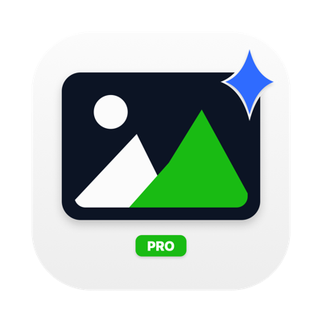
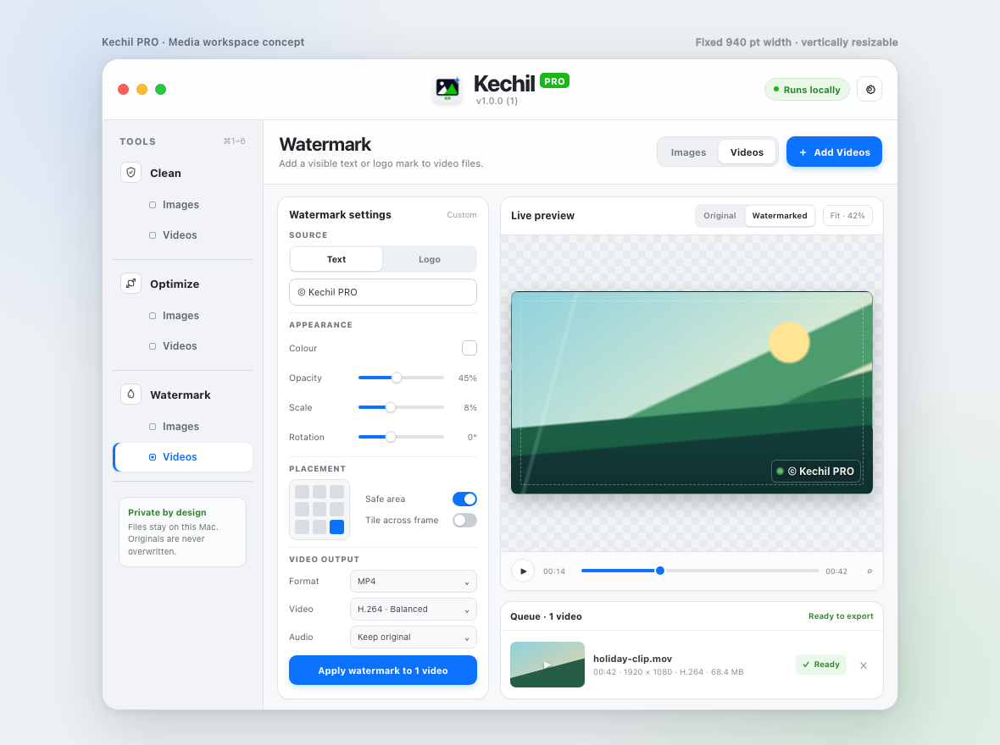
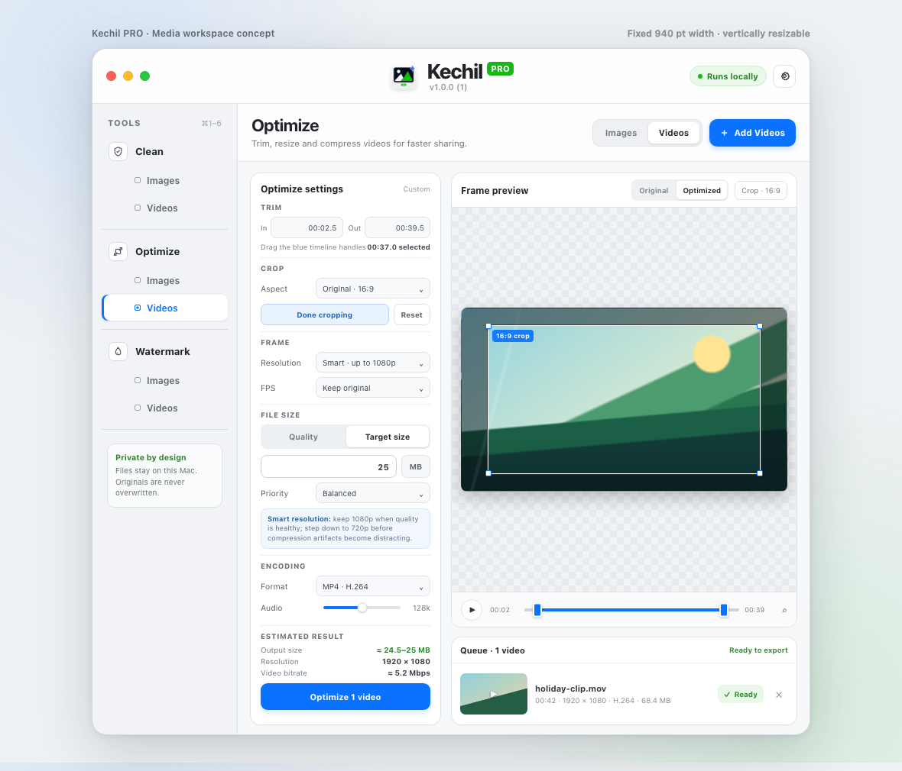
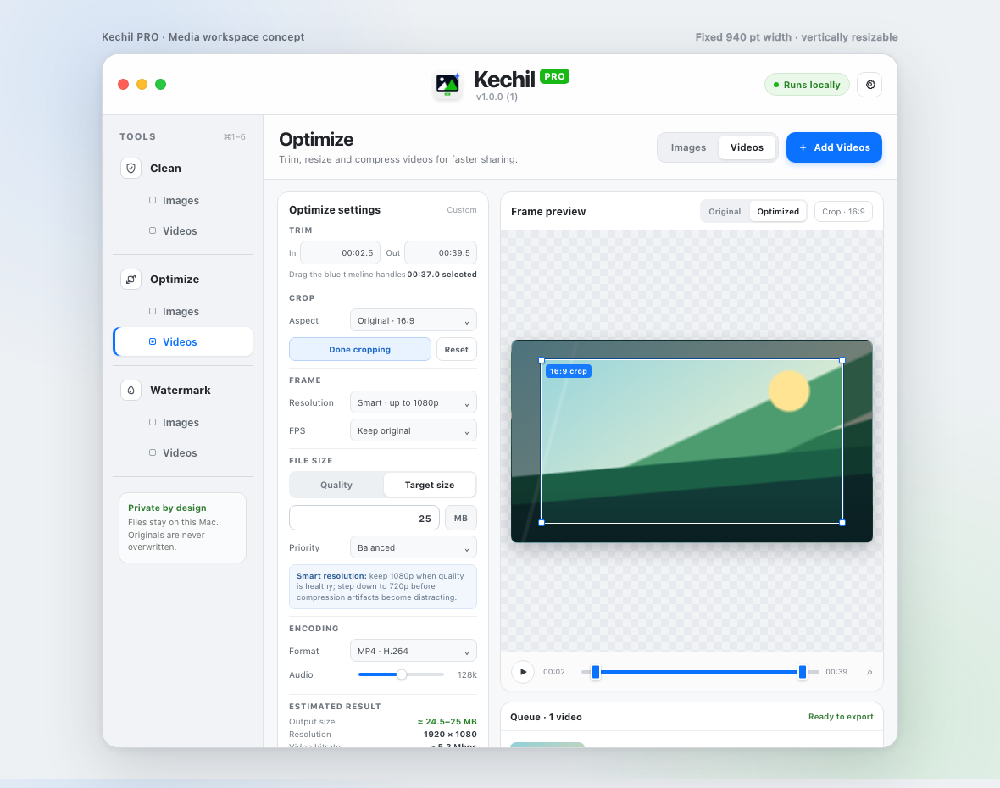

# Kechil PRO

**Clean. Optimise. Watermark. Keep your media on your Mac.**

Privacy-first, local-first macOS tools for cleaning metadata, optimising images and
videos, applying visible watermarks, and seeing realistic output-size estimates as
settings change.

**Open source under the GNU General Public License v3.0. If Kechil PRO helps your
workflow, support continued development and media-format testing:**

[Features](#features) · [Screenshots](#screenshots--product-previews) · [Install](#install-pre-built-release) · [Batch workflow](#batch-workflow) · [Privacy](#private-by-design) · [Build](#build-and-verify) · [Tested with](#tested-with) · [Support](#support-development) · [Contributing](#contributing) · [License](#license)

## Current release

The latest public GitHub release is **Kechil PRO v1.0.1 (build 2)**, following the
initial v1.0.0 release with measured output-size updates, predictable multi-file
queues, a more compact workspace for smaller MacBook screens, and a Klik PRO-style
GitHub release check in Settings. Read the [complete v1.0.1 release notes](docs/RELEASE_NOTES_v1.0.1.md)
or [view the public v1.0.1 release](https://github.com/AminudinMurad/kechil-pro/releases/tag/v1.0.1).

## ✨ v1.0.1 (build 2) highlights

- **Three focused tools** — Clean, Optimize and Watermark, each with separate
  Images and Videos modes and independent queues.
- **Real output-size estimates** — Clean, Optimize and Watermark measure the exact
  output path, including full image encoding and a real short video sample, so
  settings changes produce useful estimates rather than guesses.
- **Native batch selection** — click, Command-click and Shift-click follow familiar
  macOS queue selection behaviour across all six routes.
- **Separate multi-file saves** — Save Selected writes one prepared output directly,
  or asks once for a destination folder and writes several prepared outputs as
  collision-safe individual files.
- **Original dimensions stay truthful** — Optimize rows show each source's original
  dimensions until that item's current preview or output has rendered.
- **Consistent green actions** — Save, Save Selected and Save All share one clear
  green treatment and exact width throughout the workspace.
- **Compact 13-inch layouts** — Image and Video Optimize use the same queue-first
  structure, compact preview sizing, and aligned Save All / Save Selected controls.
- **Safer video cleaning** — provenance and exporter metadata are re-probed after
  cleaning, including no-match videos that must remain unchanged and saveable.
- **Klik-style update checks** — Settings can check the latest public GitHub release
  at launch, show “Update ready” when needed, and never download updates silently.

## Screenshots & product previews

These current native UI captures show the inspect-first Clean workflow, the compact
Image and Video Optimize queues, live output-size measurements, and the separate
Watermark routes. The gallery is followed by larger product previews of the fixed
940-point workspace.

### Clean — inspect provenance before changing a file

  

### Optimize — compact image queue and crop guidance

  

### Optimize — compact video preview, trim and queue

  

### Live output-size estimates

  

### Watermark — image and video entry routes

  
  

### Product previews

The larger product previews below show the fixed-width native workspace with a
Watermark video preview, Optimize crop and trim, and Optimize target-size mode.
They show the separate tool modes, queue, live preview, visible output controls and
the local-processing privacy cue used throughout the app.

  

  

  

For the source preview layout, see the [interactive media workspace preview](docs/mockups/kechil-media-ui.html). The native renderer also produces focused UI snapshots for compact layouts, dark appearance, disabled and busy actions, logo defaults, original dimensions and live estimate states.

## Features

### 🧽 Clean metadata

- Inspect first, then review, clean, verify and save. Importing a file never creates
  a modified output automatically.
- Image scopes include All metadata, Generative AI/provenance, EXIF and GPS.
- Video scopes include Content Credentials, descriptive metadata, XMP, location and
  container dates.
- JPEG, PNG and WebP cleaning copies compressed pixel data verbatim instead of
  decoding and re-encoding it. Orientation, protected pixels and supported carrier
  removal are verified.
- Other image containers use verified ImageIO handling and explicitly report when
  preservation requires re-encoding or has a multi-frame limitation.
- MOV, MP4 and M4V video cleaning uses supported system pass-through export, then
  reopens and re-probes the result. It reports when frames were not re-encoded
  without claiming encoded-frame identity that was not tested.
- No-match inputs produce clearly labelled unchanged copies rather than claiming
  that metadata was removed.

### ⚙️ Optimize images and videos

- Image crop, resize, format conversion and WebP quality/method controls.
- Independent crop width and height, crop focus, linked target ratio and a separate
  policy for enlarging smaller images to fill a target.
- Image formats include WebP, JPEG, PNG, HEIC, AVIF, TIFF and GIF where the macOS
  encoder supports them.
- Video trim with In and Out markers, crop focus/aspect, resolution, frame-rate,
  H.264/HEVC, audio policy and MP4/MOV output controls.
- Video quality mode or target-size mode. Target-size estimates budget bitrate from
  trim duration, audio and container overhead.
- Image Optimize fully encodes the selected image for a live byte estimate whenever
  crop, resize, format or quality settings change; the queued output is not replaced
  until an Optimize action is confirmed.
- Smart resolution can reduce dimensions before severe artefacts become distracting;
  Keep Resolution makes the quality/size trade-off explicit.
- Queue rows report each source's own original dimensions immediately when selected,
  before the current preview or output exists.

### ✨ Watermark images and videos

- Text or logo watermarks with colour, shadow, opacity, rotation, scale and safe
  margin controls.
- Nine placement positions plus tiling across the frame.
- Separate image and video workflows with live preview/output comparison.
- Image Watermark fully encodes the current output to measure its size.
- Video Watermark encodes a real short sample using the selected codec, audio,
  container and quality settings, then projects that measured rate across the full
  duration.
- Logo defaults are 90% opacity, 0° rotation, 40% scale, Centre placement and a
  2.5% safe margin. Text settings remain independent.
- Session-only appearance profiles preserve Text and Logo edits when switching
  source type; saved image presets override defaults without storing logo bytes,
  paths, queued files or output history.

## Install (pre-built release)

The latest public release is **Kechil PRO v1.0.1 (build 2)**, provided as one
universal macOS app for Apple Silicon and Intel Macs. The DMG is the recommended
download; the ZIP contains the same app as an alternative.

[**Download Kechil PRO v1.0.1**](https://github.com/AminudinMurad/kechil-pro/releases/tag/v1.0.1)

- [Download the universal DMG](https://github.com/AminudinMurad/kechil-pro/releases/download/v1.0.1/Kechil-PRO-v1.0.1-macos-universal.dmg)
- [Download the universal ZIP](https://github.com/AminudinMurad/kechil-pro/releases/download/v1.0.1/Kechil-PRO-v1.0.1-macos-universal.zip)
- [Download the DMG checksum](https://github.com/AminudinMurad/kechil-pro/releases/download/v1.0.1/Kechil-PRO-v1.0.1-macos-universal.dmg.sha256)
- [Download the ZIP checksum](https://github.com/AminudinMurad/kechil-pro/releases/download/v1.0.1/Kechil-PRO-v1.0.1-macos-universal.zip.sha256)
- [Read the complete v1.0.1 release notes](docs/RELEASE_NOTES_v1.0.1.md)

Verify the matching archive before opening it:

~~~bash
shasum -a 256 -c Kechil-PRO-v1.0.1-macos-universal.dmg.sha256
shasum -a 256 -c Kechil-PRO-v1.0.1-macos-universal.zip.sha256
~~~

The initial release is ad-hoc signed for local distribution. It is not signed with
an Apple Developer ID and is not notarised, so macOS may require the normal manual
approval flow for a downloaded app. The release notes describe this boundary and
the verified package contents.

## Batch workflow

Every tool has separate Images and Videos modes with its own queue. Queue selection
follows standard macOS conventions:

- Plain click selects one row.
- Command-click toggles individual rows.
- Shift-click selects a contiguous range.
- The last clicked row remains the preview primary.
- Clean, Optimize and Watermark Selected capture the selected IDs and current
  settings when processing starts, so a later selection change cannot expand a
  running operation.
- All actions continue to operate on the complete queue.

Save behaviour is deliberately predictable:

- **Save** saves the current prepared output.
- **Save Selected** saves one selected prepared output directly. With several
  selected prepared outputs, Kechil asks once for a destination folder and writes
  each output separately with a collision-safe filename and its own extension.
- **Save All** saves every prepared output in the queue to the selected folder.
- Pending settings are never silently processed by a save action.
- Originals are never overwritten. Existing destinations are not replaced.

Separate files are used for multi-file Save Selected instead of creating a ZIP so
the result is immediately usable, preserves each output format, and does not force
an extra extraction step for a normal batch export.

## Private by design

Kechil processes media on the Mac. It does not upload media, use telemetry, make a
licensing call or run a background upload. The sandbox allows outbound client access
only for an explicit direct image/video URL fetch supplied by the user; there is no
inbound network server.

Every empty route and the workspace toolbar include **Paste URL**. It accepts a
direct http(s) image/video URL, a local file URL or an absolute path. The clipboard
is read only when its icon is clicked. Remote sources are downloaded to a temporary
local file before entering the same on-device queue.

Kechil intentionally rejects YouTube, Facebook and Instagram page or delivery URLs.
It does not scrape webpages, accept social-account cookies or reconstruct protected
playback streams. Export media you own through YouTube Studio, Google Takeout or
Meta Accounts Center, then add the resulting local file to Kechil.

The About card links to the GPL-3.0 terms and the public Kechil PRO GitHub repository,
alongside GitHub Sponsors, Ko-fi and PayPal. Settings can automatically check the
public GitHub latest-release endpoint at launch, or the user can run the check
manually. The app never downloads an update automatically and sends no media or
account information with the check.

## AI provenance: evidence, not a trust verdict

Kechil PRO reads common provenance carriers and reports standard IPTC Digital Source
Type declarations, C2PA/JUMBF claims, XMP, prompts, models, edit history and common
generator fields. Findings are marked as declared, stated or inferred. It does not
mistake computationalCapture, for example phone HDR, for Generative AI.

This is **not** C2PA cryptographic validation: signatures, trust chains, revocation
and asset bindings are not validated. Brotli-compressed assertions may be located
without being decoded.

Invisible in-pixel watermarks such as SynthID are not metadata and are not removed.

## How it works

Kechil is a native SwiftUI/AppKit workspace with separate media pipelines for
inspection, cleaning, image optimisation, video export and watermarking. Clean keeps
lossless container paths where that is technically possible; Optimize and Watermark
intentionally re-render pixels and pass their outputs through metadata removal before
the final save.

The live estimate card follows the same output path used by the tool. Changing the
selected source or a relevant setting cancels stale work and starts a new measurement.
Changing a setting never writes an output by itself. After preparation, the card
switches from an estimate to the measured byte count of the prepared artifact.

## Build and verify

Requires macOS 13+ and a full Xcode installation. There is no Xcode project or
package-manager dependency; WebP support uses the pinned, vendored libwebp source in
vendor/libwebp.

~~~bash
tools/check.sh                    # type-check plus all deterministic checks
tools/build-app.sh                # native build
UNIVERSAL=1 SIGNED=1 tools/build-app.sh
tools/make-dmg.sh                 # universal DMG + SHA-256 sidecar
tools/make-zip.sh                 # universal app ZIP + SHA-256 sidecar
~~~

tools/check.sh verifies every vendored libwebp source-file hash before compilation.
tools/make-dmg.sh refuses to package a signed build without sandboxing and the
outbound client entitlement, or if an inbound network-server entitlement is present.

The resulting app is at build/Kechil PRO.app; release packages are in releases/.

## Tested with

The v1.0.1 (build 2) source and its public package passed the full verification gate.
Coverage includes:

| Area | Coverage |
| --- | --- |
| Shared actions | 29 assertions for exact widths, green states, Selected/All availability and busy behaviour |
| Update checking | 6 assertions for semantic release-version comparison and tag normalisation |
| Queue selection | 9 assertions for click, Command-click, Shift-click, captured IDs and mixed queues |
| Real media interactions | 117 assertions across image/video Clean, Optimize, Watermark, playback, saving and source preservation |
| Packaging | Universal arm64 + x86_64, hdiutil verify, ZIP integrity, checksum sidecars and strict/deep app signature verification |
| UI | 39 native SwiftUI snapshots rendered and inspected, including compact, dark, busy, estimate, logo-default and original-dimension states |

The full release evidence is in [the batch-actions QA report](docs/qa/BATCH_ACTIONS_QA_2026-08-31.md) and [the development handoff](docs/DEVELOPMENT_HANDOFF.md).

The [v1.0.1 release notes](docs/RELEASE_NOTES_v1.0.1.md) record the published package
hashes, signing boundary and final verification results.

## Project layout

~~~text
Sources/    SwiftUI workspace, image/video Clean, Optimize and Watermark pipelines
Tests/      deterministic Swift and Python correctness tests
vendor/     pinned libwebp 1.6.0 source and SHA-256 manifest
tools/      checks, native builds, UI snapshots and release packaging
App/        bundle metadata and sandbox entitlements
assets/     app icon artwork and product preview assets
docs/       install notes, plans, QA evidence, release notes and previews
~~~

## Support development

Optional support helps fund continued development, compatibility testing and future
media-format work:

- [GitHub repository](https://github.com/AminudinMurad/kechil-pro)
- [GitHub Sponsors](https://github.com/sponsors/aminudinmurad)
- [Ko-fi](https://ko-fi.com/aminudinmurad)
- [PayPal](https://www.paypal.com/paypalme/aminudinmurad)

## Contributing

Contributions are welcome. Please open an issue before a substantial change, preserve
the original-file safety boundary, run tools/check.sh, and include the relevant
visual or media evidence with the pull request. Do not add generated-by, AI
co-author, attribution or similar metadata to commits or release material.

## License

Copyright © 2026 Aminudin Murad. Kechil PRO is open source under the GNU General
Public License v3.0. See [LICENSE](LICENSE). Third-party notices are in
[NOTICE.md](NOTICE.md), and security reports should follow [SECURITY.md](SECURITY.md).
